# My Project Portfolio

This is a portfolio of project works I undertook during my undergraduate studies. Most of these projects were completed independently, without the guidance of a mentor, relying solely on my own explorations. These projects encompass a wide range of topics, including 3D computer vision, traditional image processing, deep learning, intelligence algorithm and SLAM.

Thanks to these experiences, even if not cutting-edge research, they have enriched my academic life.

## Internship:

* [Auto Keystone Correction Projector with Structured Light Pair](./internship/auto%20keystone%20correction%20projector%20with%20camera/README.md): The calibration process in this study involves local homography and Gray code, while the correction process determines keypoint depths through triangulation and projection plane fitting. Simultaneously, an accelerometer measures gravity's direction. The primary focus of this research lies in obtaining the largest and sharpest inner rectangle within any convex projected quadrilateral.
* [Auto Keystone Correction Projector with TOF](./internship/auto%20keystone%20correction%20projector%20with%20TOF/): Plane detection is facilitated using the VL53L5CX multi-point Time-of-Flight (TOF) sensor from STMicroelectronics. Data fluctuations are mitigated through a filtering process, and the robustness is further enhanced by the introduction of the Random Sample Consensus (RANSAC) algorithm. In other aspects, this study follows a similar approach to the previous research.

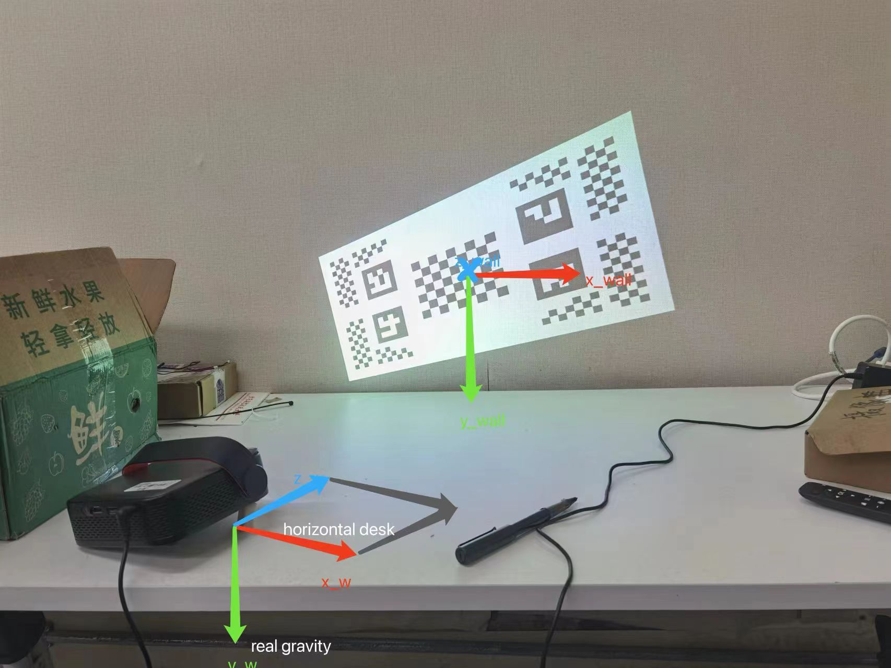
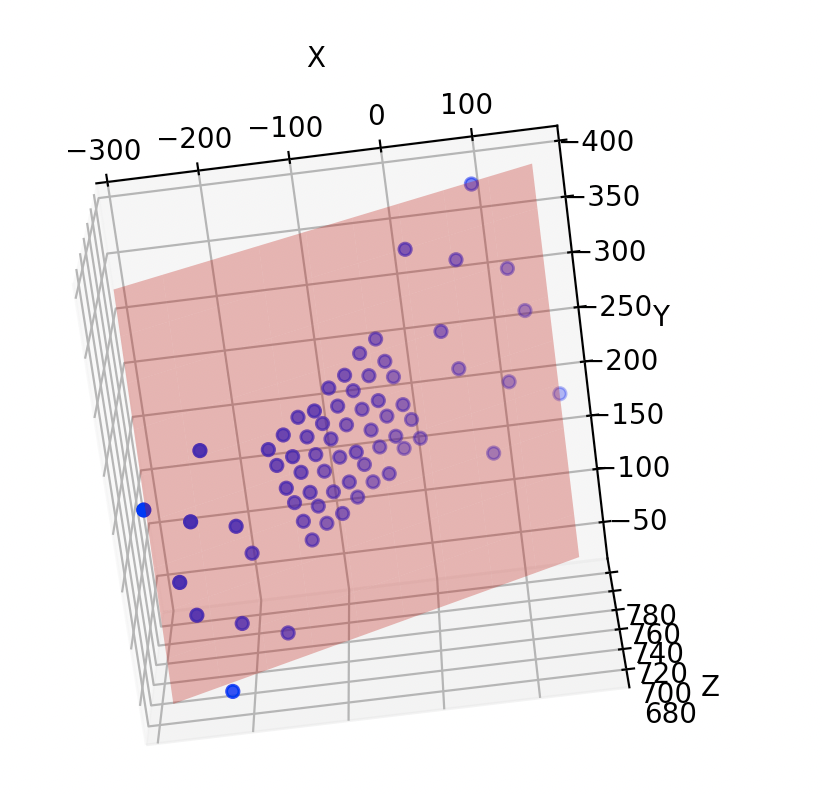

## Robotics Team of BUAA:

* [Auto-shoot Algorithm Based on Deep Learning for Racing Robot in CURC ROBOCON 2023](./robotics%20team%20of%20BUAA/ROBOCON2023/): Information for target identification and encoding is provided through the fusion of data from laser radar, wheel odometry, and an Inertial Measurement Unit (IMU) as a priori localization. Deep learning techniques are employed for target identification, and by incorporating localization information, precise angular deviations are calculated. These deviations are then fed back to the motor driver chip, enabling precise and automated shooting. At the 2023 CURC ROBOCON competition, the outstanding performance of our robot served as a validation of the algorithm's precision and robustness.
[Related Video](https://www.bilibili.com/video/BV1mX4y1Y7Pd/?share_source=copy_web&vd_source=b58b58ccf1b63dc656c22a30535762cc)

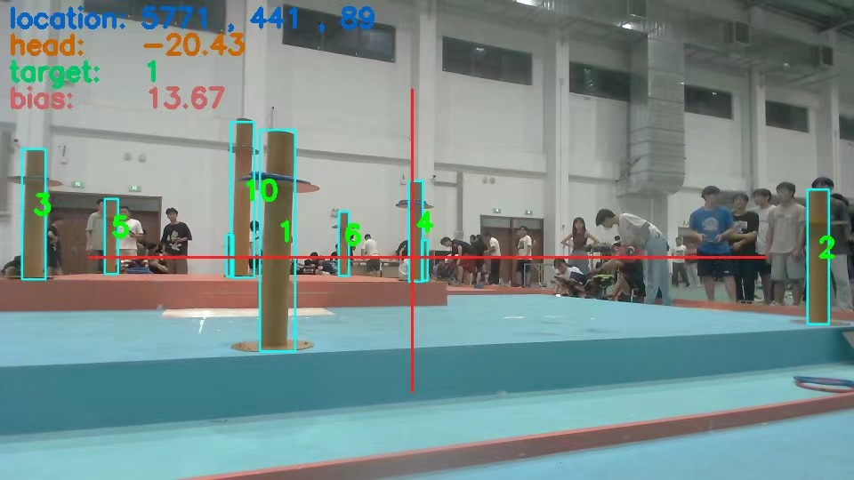

* Target trajectory analysis with stereo camera : A sliding window is introduced based on the recognition results from the previous frame to reduce the computational cost of the deep learning component. The principles of triangulation are employed to obtain the three-dimensional coordinates of the target. Kalman filtering is responsible for enhancing data smoothness, predicting missing identification information, and improving overall robustness.

* [Team entry test](./robotics%20team%20of%20BUAA/training/README.md): Test I gave to prospective team members. It's a camera pose estimation task. In a scenario with known three-dimensional coordinates, camera pose is calculated using the Perspective-n-Point (PNP) principle. Combining the corner detection results from the previous frame facilitates the correspondence between 2D points and 3D points. Through continuous recognition, the camera's trajectory is traced and plotted. Prior to this, I conducted knowledge dissemination sessions for new team members on topics related to monocular imaging and camera calibration.
[Related Video](https://www.bilibili.com/video/BV1TM4y1d7x5/?share_source=copy_web&vd_source=b58b58ccf1b63dc656c22a30535762cc)

* Team trainning: This is a slide I made to give technical instructions to new team members

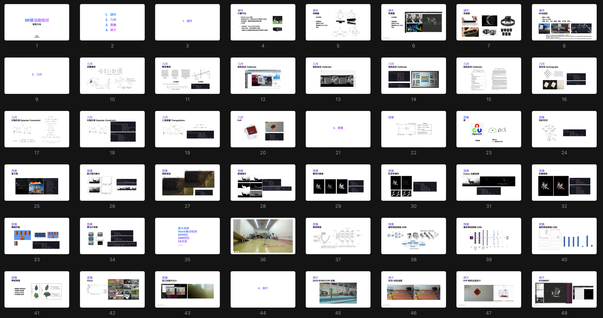

## Soft Robotics Lab:

* [An Aerial–Aquatic Hitchhiking Robot with Remora-Inspired Tactile Sensors and Thrust Vectoring Units](https://onlinelibrary.wiley.com/doi/10.1002/aisy.202300381): I am mainly responsible for the debugging of flight control, assisting some experiments, and working on the deployment of SLAM and automatic navigation algorithms on the next generation of robots.

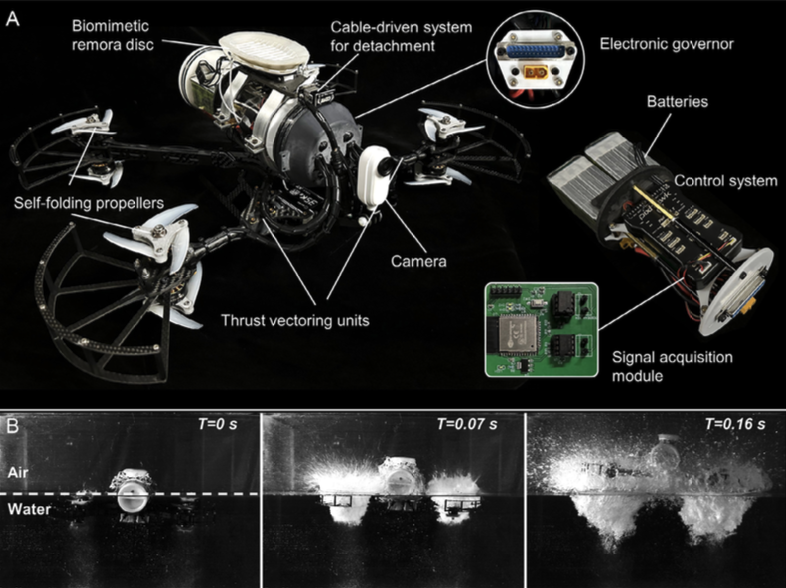
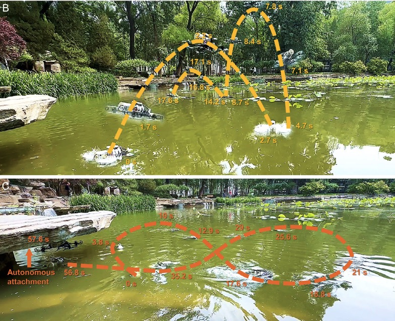

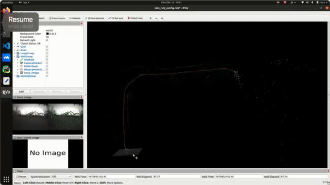

## AI Program in NUS:
* [Seq2Seq population forecasting model](./AI%20program%20in%20NUS/)

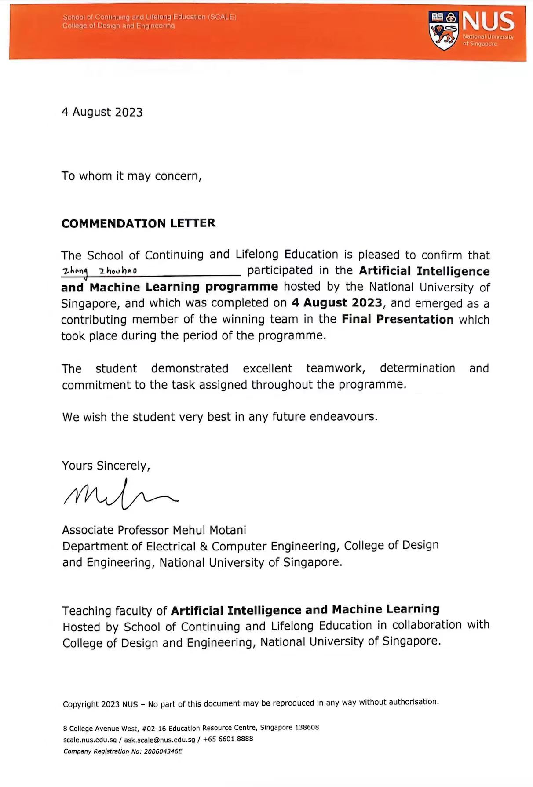

## In-class Experiments:
I take every experiment in class seriously, cherish these practical opportunities, and always exceed the teacher's tasks. This seriousness is also reflected in my grades.

* [Comparison experiments between CNN and Dense](./in-class%20experiments/Comparison%20experiments%20between%20CNN%20and%20Dense/README.md)

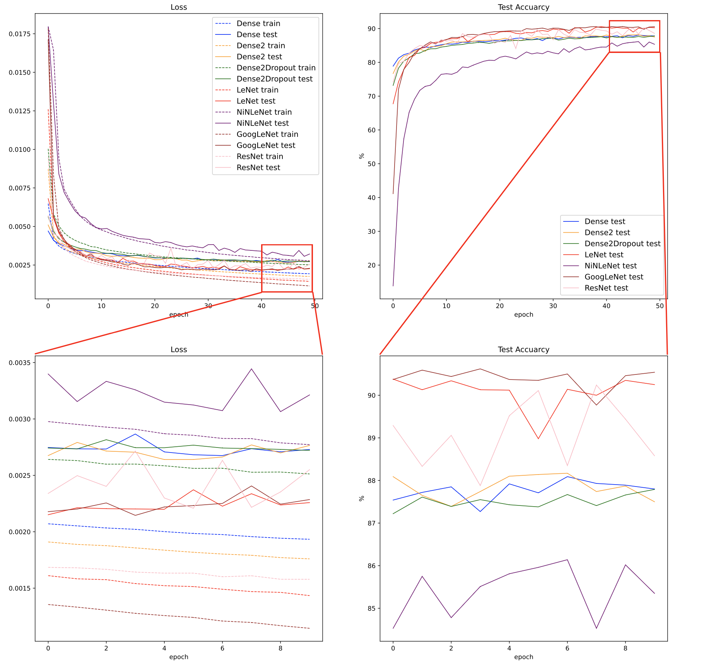

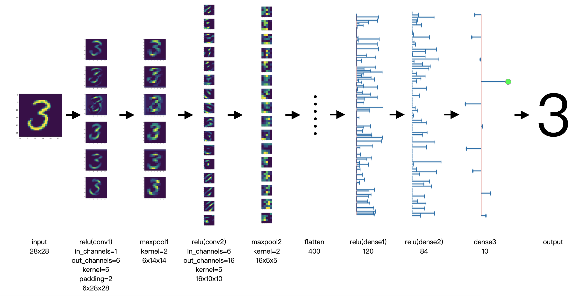

* [Experiments on Medical Image segmentation (Liver)](./in-class%20experiments/Experiments%20on%20Medical%20Image%20segmentation/liver/README.md)

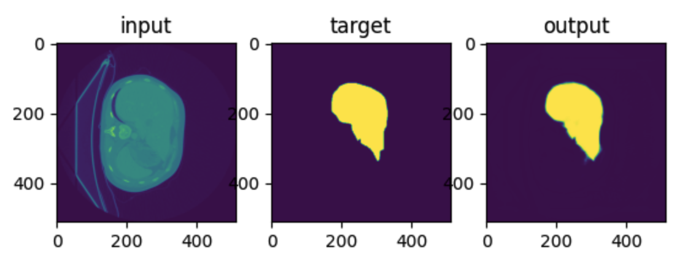
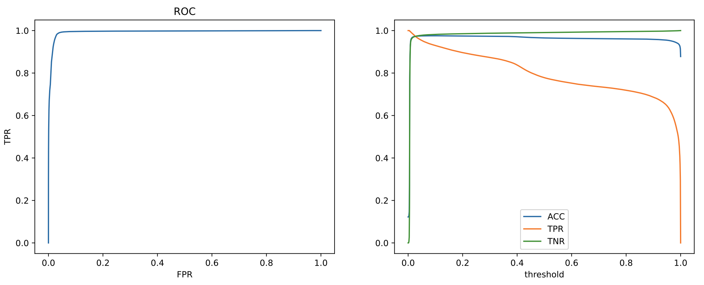

* [Experiments on Medical Image segmentation (Retinal vessels)](./in-class%20experiments/Experiments%20on%20Medical%20Image%20segmentation/Retinal%20vessels/README.md)

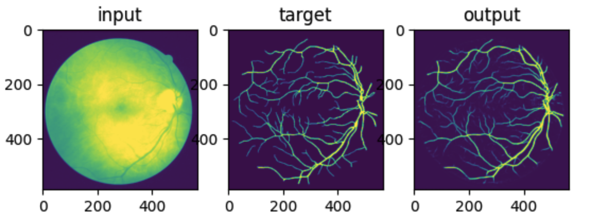
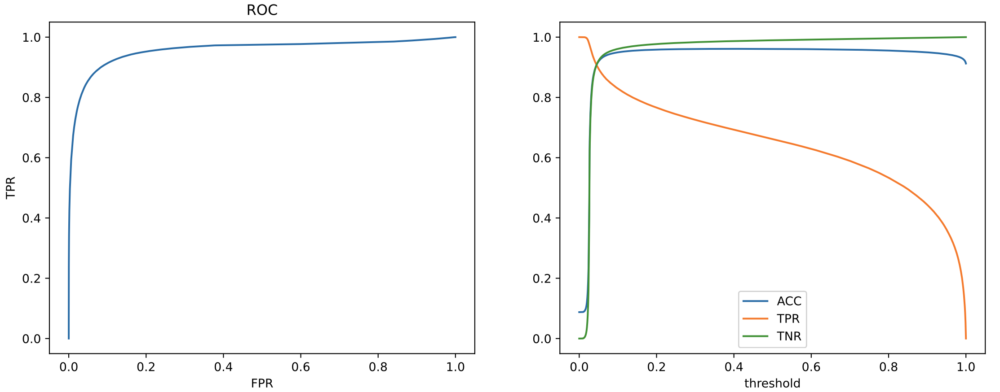

* [EEG-based Motor Imagery Classification](./in-class%20experiments/EEG-based%20Motor%20Imagery%20Classification/README.md)

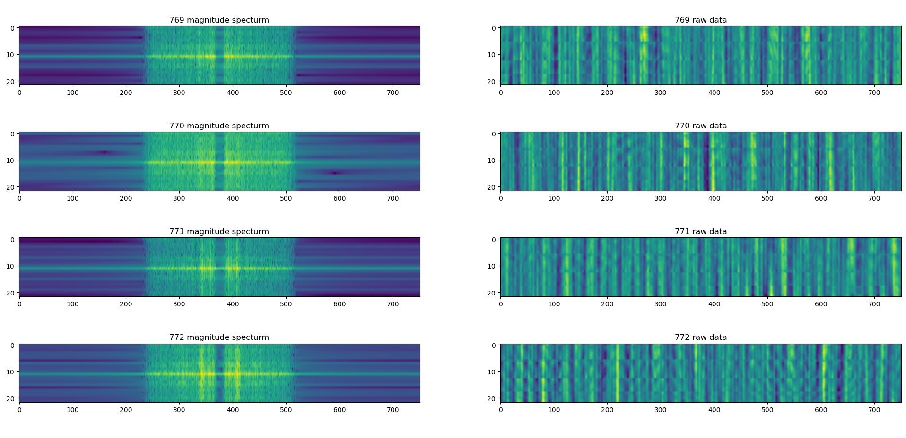
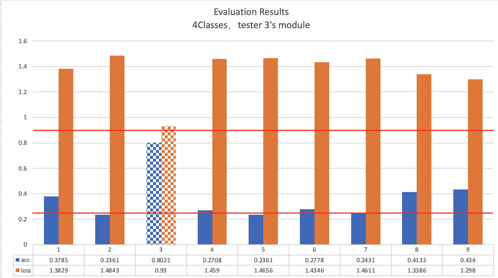

* [Recognition of handwritten Arabic characters](./in-class%20experiments/Recognition%20of%20handwritten%20Arabic%20characters/README.md)

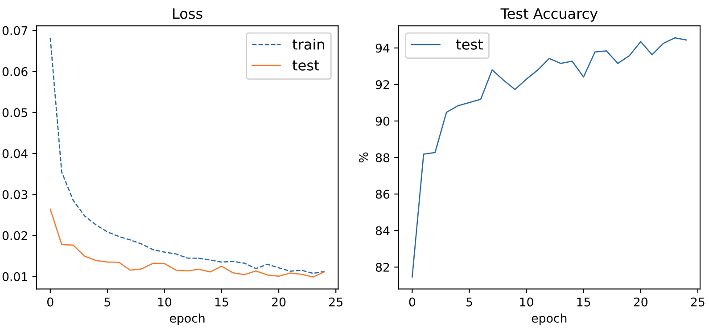

* [Robot path planning experiments](./in-class%20experiments/Robot%20path%20planning%20experiments/README.md)
[Related Video](https://www.bilibili.com/video/BV1Us4y1g7rq/?share_source=copy_web&vd_source=b58b58ccf1b63dc656c22a30535762cc)

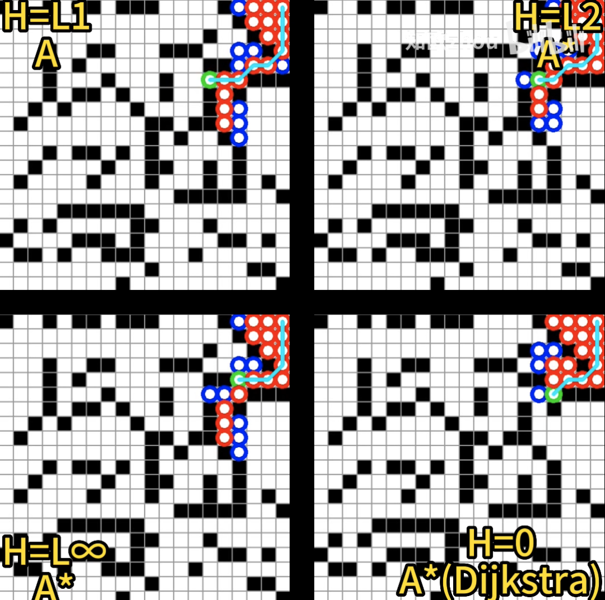

* GMM Built by EM Algorithm

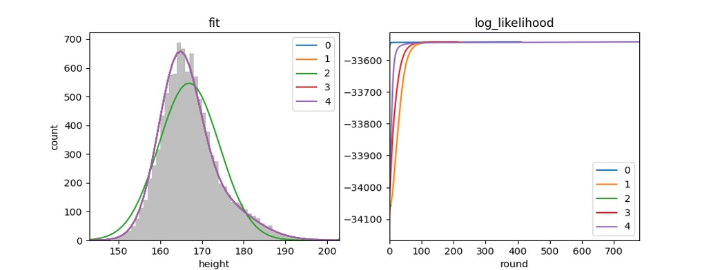

